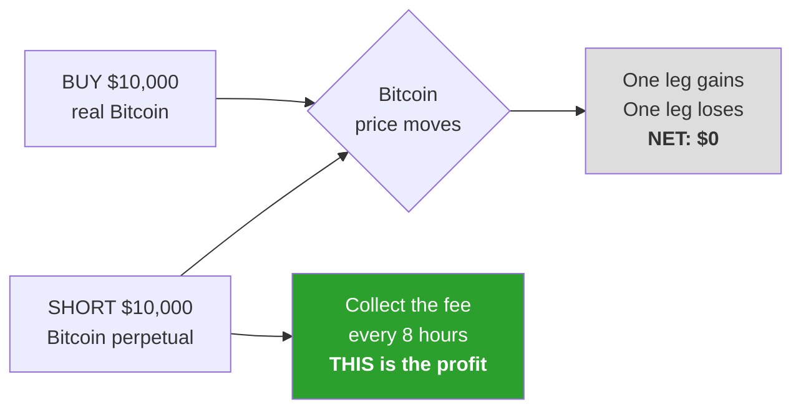

# BRIEF FOR CLAUDE

Turn this into a **short, visual report** for a non-technical business audience.

Requirements:
- Keep it brief. One page equivalent. Do not pad it.
- **Keep the visuals** — the diagram and the bar charts are the point. Rebuild them
  as proper charts if you can; keep them as-is if you cannot.
- Explain how the strategy works in plain language, early, using the worked example.
- Lead with the verdict. Do not soften it.
- Do not invent findings beyond what is below.

---

# Crypto Funding-Rate Carry — Research Findings

**Date:** September 02, 2026 · **Verdict: Do not deploy capital.**

The strategy earned 12% a year for seven years. It now earns about 2.7% — less than a
savings account, while carrying a real risk of total loss. It was profitable, it became
popular, and the profit was competed away.

---

## How the strategy works

On crypto exchanges you can buy a **perpetual** — a contract that tracks Bitcoin's price
but never expires. Because it never expires, nothing forces its price to match real
Bitcoin. Exchanges fix this by charging a fee every 8 hours: **whichever side of the
market is overcrowded pays the other side.**

Crypto traders are almost always crowded on the buy side. So this fee has flowed from
buyers to sellers, three times a day, for years.

The trade collects that fee while taking **no price risk at all**:



If Bitcoin rises 20%, the real coins gain $2,000 and the short loses $2,000. Net zero.
The position does not care where Bitcoin goes. It only collects the fee.

### The money, concretely

At the typical fee of 0.01% per payment, on a $10,000 position:

```
  $1.00  per payment
    x3   payments per day
= $3.00  per day
= $1,095 per year        ...on $10,000 = roughly 11% a year
```

No prediction is involved. The fee is a number the exchange publishes in advance.

---

## What we found

Seven years of real data. Bitcoin: 7,647 payments, Sep 2019 – Sep 2026. Ethereum: 7,413
payments. Bitcoin returned **12.31% a year**, Ethereum **14.88% a year**.

But look at when that money was made.

### Bitcoin — annual return, and the collapse

```
2020   ███████████████████                    +18.81%
2021   ████████████████████████████████████   +35.79%
2022   ████                                    +4.25%
2023   ████████                                +8.18%
2024   █████████████                          +12.70%
2025   █████                                   +5.26%
2026   ██                                      +1.79%   (8 months)
```

**$10,000 earned $3,579 in 2021. The same $10,000 has earned $179 so far in 2026.**

### The fee is also reversing more often

Sometimes the fee flows the other way and *you* pay it. That is happening far more now:

```
2021   ███████                                  7.31% of payments
2022   ██████████████████████                  22.10%
2023   ██████████                              10.14%
2024   ████████                                 8.38%
2025   █████████████                           12.88%
2026   ████████████████████████████            28.38%   <-- worst on record
```

Double hit: the payments got smaller, **and** they reverse four times more often.

---

## Why it died

This was never a market inefficiency. It is a **fee for a service** — absorbing risk that
leveraged buyers do not want to hold.

As more institutional money lined up to provide that same service, the fee needed to
attract a taker collapsed. Same demand, far more supply.

**The strategy did not break. It got crowded.**

---

## One more finding worth keeping

We also tested a "smarter" version that steps aside when the fee turns negative.

**It lost to the simple version in every single year, on both assets** — 10.47% vs 12.31%
on Bitcoin, with a worse drawdown.

The rule can only detect a bad period after it has mostly happened, so it sells at the
bottom and buys back after the recovery. 42 round trips cost 12.60% in fees — more than
the bad periods it avoided.

*Lesson: added sophistication is not automatically an improvement. A filter has to pay for
itself on both timing and cost.*

---

## The risk the numbers do not show

The strategy's drawdown looks tiny (1.51%) because that figure tracks only the fees
collected. It excludes the things that actually cause losses here:

- **Forced liquidation** — the short leg sits on margin. A sharp rally can trigger a
  forced close even though the Bitcoin holding gained the same amount, because the two
  sit in separate accounts. This, not negative fees, is what has historically wiped
  people out on this trade.
- **Exchange failure** — both legs sit at one venue. It must stay solvent and allow
  withdrawals.

A smooth return curve hiding a small chance of total loss is more dangerous than an
obviously volatile one, because it invites oversized positions.

---

## Verdict and next steps

**Do not deploy capital.** ~2.7% annualised is below the risk-free rate, with genuine
liquidation and exchange risk attached. The trend is clearly negative.

The study still did its job: a widely promoted strategy was tested against seven years of
real data and rejected in under a day, before any capital or engineering time was spent.

**Recommended next:**

1. **Test whether the good periods are predictable.** Returns were lumpy — 2021 paid 35%,
   2022 paid 4%. If high-fee periods can be spotted in advance, being active only during
   those would be a genuinely different and better strategy.
2. **Reuse the fee as a warning signal.** A high fee means the market is heavily leveraged
   long — useful information for other strategies. The data is already collected.
3. **Validate the existing strategy library before building anything new.**
